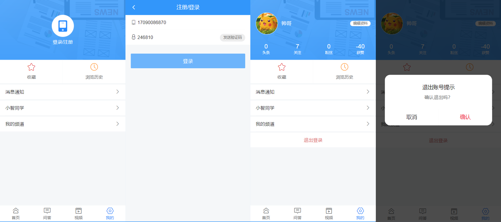
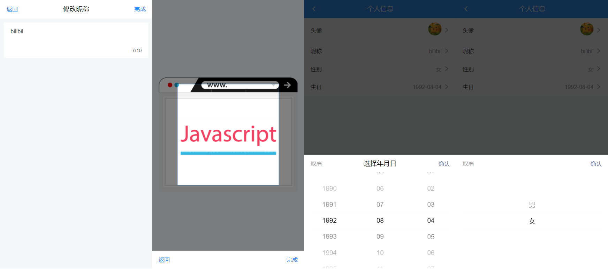
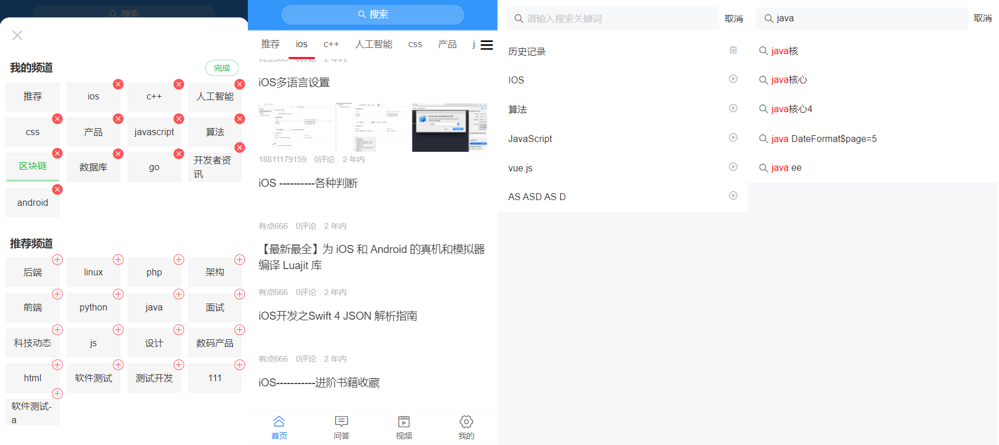
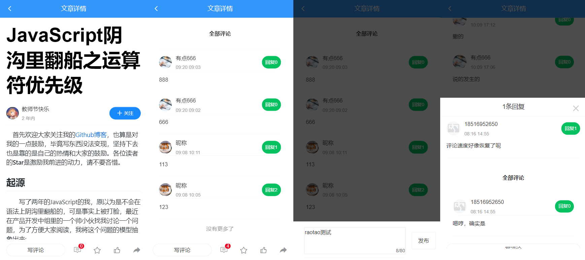

## toutiao-m

**技术栈Vue + Vue Router + Vuex + axios + vant + webpack + PostCss + dayjs**

 - 实现功能：登入/注册、收藏/评论、搜索/查看、文章列表/详情、用户中心、频道管理等。
 - 主要技术栈：Vue(全家桶)+ webpack + axios + Vant + PostCss + Scss 
 - 项目难点及解决：
  1)	访客状态和登入状态和不同账号下页面缓存的冲突问题，通过封装的Storage模块结合Vuex和keep-alive的include，在每次登录或退出时，添加和清除缓存。并实现用户token的持久化。 
  2)	文章详情页中对评论的回复涉及到隔代组件间通信，通过$emit()向上传递抛出事件并传值。
 - 项目优化：封装debounce函数，优化实时搜索联想、关键字高亮，减少Ajax请求和重绘。

点击进入部署至Github_pages的线上地址 ,由于不是纯本地的项目，需要服务器部署，这个页面无法获得到完整数据， 

https://raotaohub.github.io/xinwentoutiao-m/ 


- 登录及退出页

<br>


- 个人中心及编辑页

<br>


- 频道中心 支持添加删除，读取本地存储的数据

<br>


- 文章及评论页

<br>


#### 下载项目,在本地任意处打开cmd/git命令栏，输入以下指令回车即可
```
git clone https://github.com/raotaohub/xinwentoutiao-m.git
```
#### 安装依赖
```
npm install
```

#### 运行项目
```
npm run serve
```

#### 本地打包项目
```
npm run build
```
