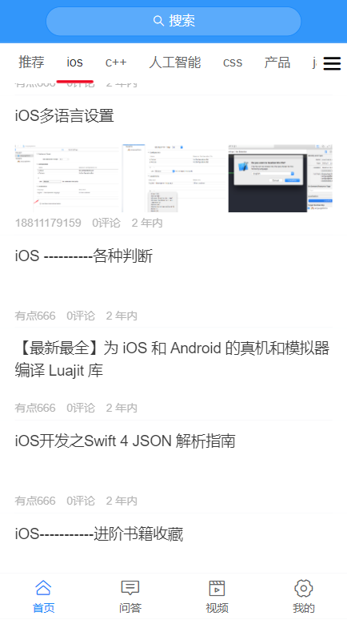
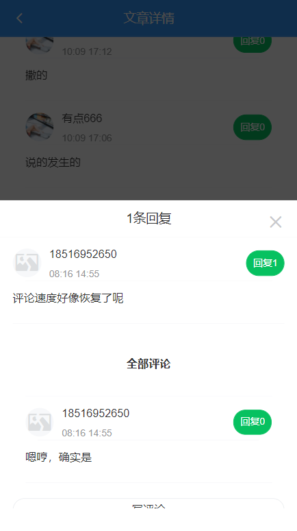

## toutiao-m

**技术栈Vue + Vue Router + Vuex + axios + vant + webpack + PostCss + dayjs**
本地封装了一个storage.js模块用于本地存取以及debounce.js防抖函数模块

// 线上地址 由于不是纯本地的项目，需要服务器部署，这个页面无法获得到完整数据，因此暂时搁置一下！

点击进入部署至Github_pages的线上地址 https://raotaohub.github.io/xinwentoutiao-m/
===
- 首页

- 个人中心

- 文章列表，支持下拉刷新，上拉加载更多

对评论进行回复

#### 下载项目,在本地任意处打开cmd/git命令栏，输入以下指令回车即可
```
git clone https://github.com/raotaohub/xinwentoutiao-m.git
```
#### 安装依赖
```
npm install
```

#### 运行项目
```
npm run serve
```

#### 本地打包项目
```
npm run build
```
