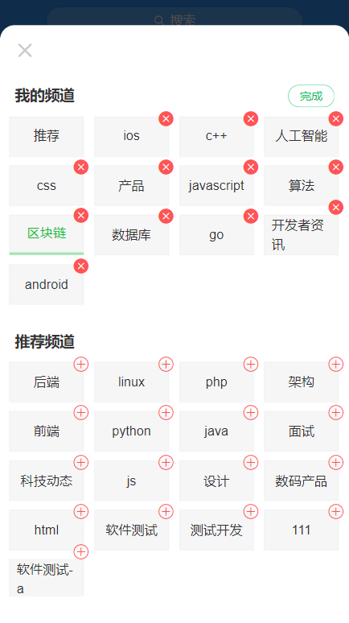

## toutiao-m

**技术栈Vue + Vue Router + Vuex + axios + vant + webpack + PostCss + dayjs**

本地封装了一个storage.js模块用于本地存取以及debounce.js防抖函数模块


点击进入部署至Github_pages的线上地址 ,由于不是纯本地的项目，需要服务器部署，这个页面无法获得到完整数据， 

https://raotaohub.github.io/xinwentoutiao-m/ 


#### 下载项目,在本地任意处打开cmd/git命令栏，输入以下指令回车即可
```
git clone https://github.com/raotaohub/xinwentoutiao-m.git
```
#### 安装依赖
```
npm install
```

#### 运行项目
```
npm run serve
```

#### 本地打包项目
```
npm run build
```

- 首页 

<br>

- 个人中心 支持编辑个人资料

<br>


- 文章列表，支持下拉刷新，上拉加载更多

<br>


- 频道中心 支持添加删除，读取本地存储的数据

<br>


- 对评论进行回复

<br>


